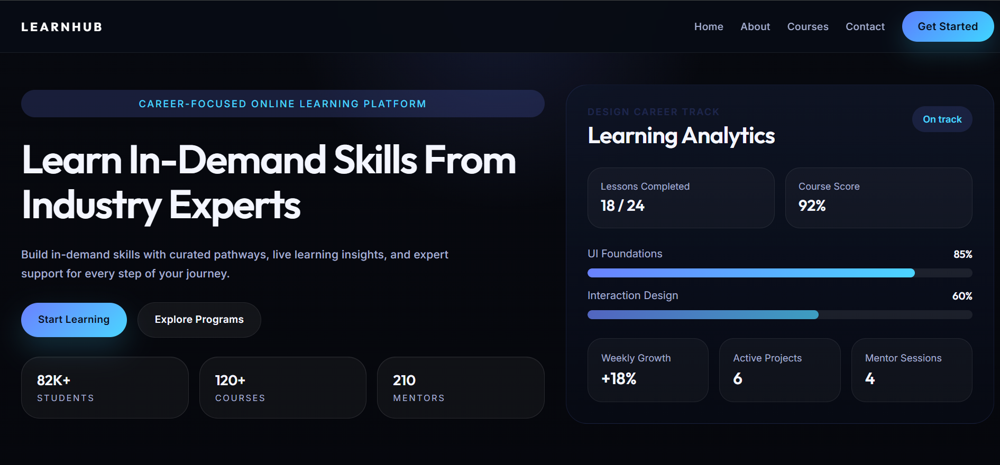
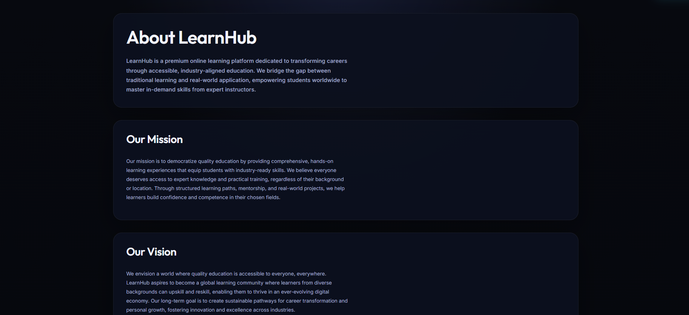
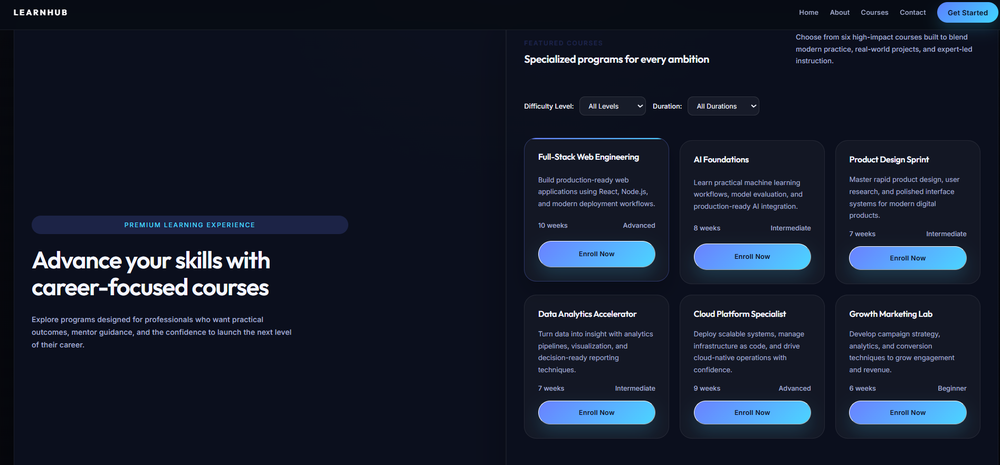
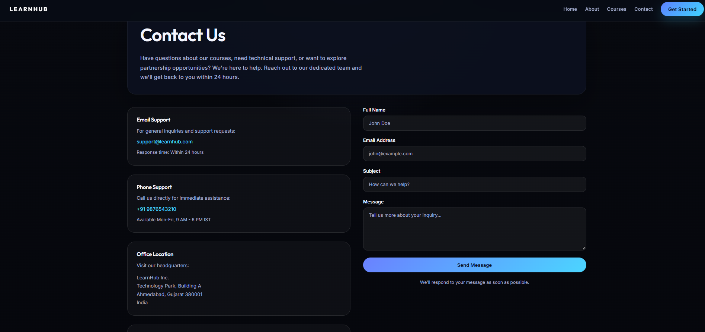
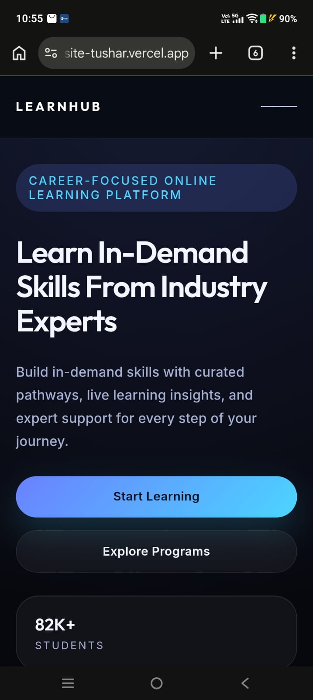

# LearnHub Multi-Page Website

## Overview

LearnHub is a modern and responsive multi-page educational website developed using React, React Router, and Vite. The website provides users with a professional learning platform experience through dedicated Home, About, Courses, and Contact pages with smooth navigation and a consistent user interface.

## Features

- Responsive Design
- Multi-Page Navigation
- React Router Integration
- Home Page
- About Page
- Courses Page
- Contact Page
- Mobile Friendly Layout
- Modern User Interface
- Consistent Design Across Pages

## Technologies Used

- React.js
- React Router DOM
- JavaScript
- CSS3
- Vite

## Live Demo

https://synent-task7-coursewebsite-tushar.vercel.app

## GitHub Repository

https://github.com/tushar-2606/synent-task7-coursewebsite-tushar

## Project Structure

```plaintext
coursewebsite/
│
├── public/
├── screenshots/
│
├── src/
│   ├── components/
│   │   ├── Navbar.jsx
│   │   └── Footer.jsx
│   │
│   ├── pages/
│   │   ├── Home.jsx
│   │   ├── About.jsx
│   │   ├── Courses.jsx
│   │   └── Contact.jsx
│   │
│   ├── App.jsx
│   ├── App.css
│   └── main.jsx
│
├── package.json
├── vite.config.js
└── README.md
```

## Screenshots

### Home Page



### About Page



### Courses Page



### Contact Page



### Mobile View



## Installation

Clone the repository:

```bash
git clone https://github.com/tushar-2606/synent-task7-coursewebsite-tushar.git
```

Install dependencies:

```bash
npm install
```

Run the project:

```bash
npm run dev
```

## Learning Outcomes

Through this project, I improved my understanding of:

- React Components
- React Router DOM
- Component Reusability
- Responsive Web Design
- Multi-Page Application Development
- Modern UI Development
- Frontend Project Structure

## Author

Tushar Prajapati

## License

This project was created for learning and internship purposes.